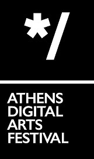

# uncanny canyon

by michael kolesidis

**Featured in Athens Digital Arts Festival 2023**

[**uncanny canyon in ADAF**](https://online.adaf.gr/video/uncanny-canyon/)

## Summary

A 3D web experience, an interactive spatiotemporal poem, set in an era when humanness appears to be on the verge of being rendered undefinable. Participants explore a seemingly deserted canyon, while interacting with a synecdochical representation of artificial intelligence, unraveling a concurrency of a multiplicity of fragmented, albeit interwoven, narratives. A hypnagogic glimpse into hitherto unseen interpretations of humanity: simultaneously dehypostasized and oversemantizised, uncannily excluded from the realm of knowable.

The piece explores redefinitions and reinterpretations of humanness and non-humanness with their reciprocal conflicts and synergies. It dives deep into the vastness of a technological hyperreality, examining perceptual transformations in our ability to delineate human consciousness. During this process, novel definitions of uncanniness emerge, as our concern that "humanity will not go extinct, but will simply become irrelevant" moves from the background to the foreground of our civilization.

## Artwork Documentation

[uncanny canyon](https://docs.google.com/document/d/1osOCtdUGjlvaZNHYEnBOjEUEwFj5L9qizVWQsWzC9nY/edit?usp=sharing)

## Technologies Used

- three.js
- Howler.js
- OpenGL Shading Language
- Vite
- JavaScript
- CSS
- HTML

## Short Bio

Michael Kolesidis is a multidisciplinary new media artist, with a background in creative development, performance art and computer science. He works at the intersection of performativity and digitality, attempting to blend art with digital technology with varying degrees of success. Nowadays, he explores graphics programming and a multitude of new media technologies to create web art, audiovisual art and physical installations. He has lived, worked, and studied in Greece, Spain, and the UK, and has presented his work in Greece and the UK.

## 💖 Support the Project

Thank you so much for your interest in my project! If you want to go a step further and support my work, buy me a coffee:

